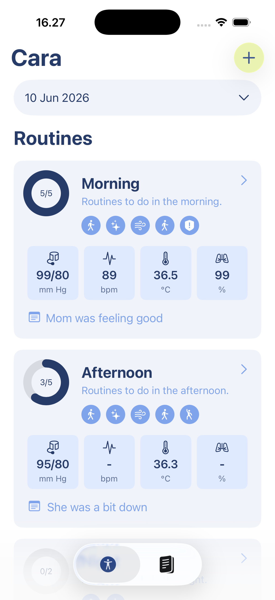
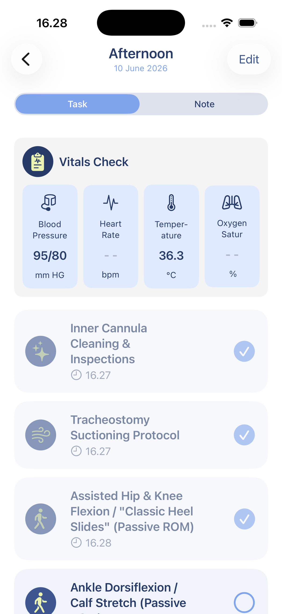
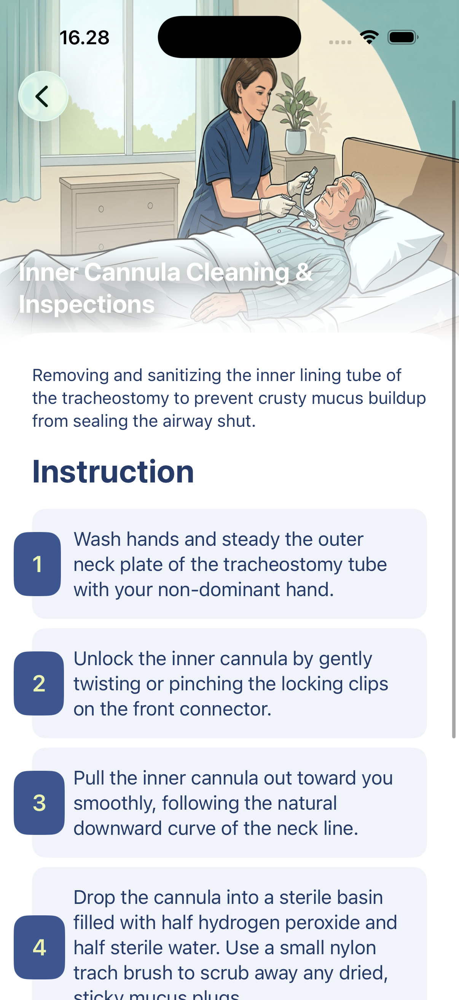
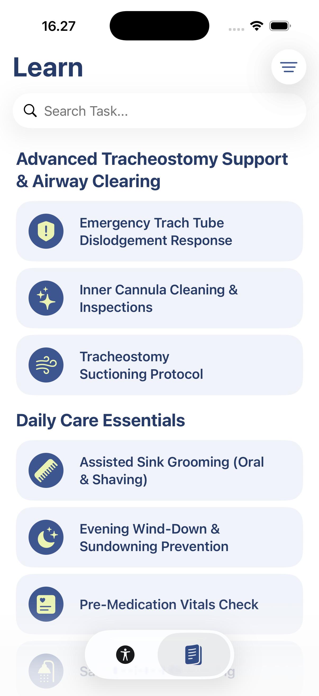

# CARA

**Give care with confidence.**

Empower your transition into a caregiving role. CARA is a digital caregiving app that empowers family caregivers to provide structured post-stroke care at home.

## Screenshots

  
  
  
  

## Overview

Stroke often leaves family members suddenly responsible for caregiving, despite having little or no prior experience. This "overnight crisis" can lead to confusion, stress, and uncertainty in daily care. CARA bridges the critical gap in post-stroke support, providing structured home-care routines that help caregivers deliver high-quality care with greater confidence, consistency, and peace of mind.

## Core Features

* **Set Up Daily Care:** Quickly start with proven, pre-built caregiving routines or personalize custom routines tailored to the patient's specific needs.
* **Follow Daily Routines:** Easily view daily care tasks, record vital signs (like blood pressure and temperature), and add custom tasks to stay organized.
* **Learn While Caring:** Access category-based care guides and step-by-step task instructions designed in simple language to help caregivers learn on the go.
* **Task Trackers:** Reduce mental load and emotional burnout through clear time boundaries, allowing caregivers to track completed duties instantly.

## Target Audience

* **Family Caregivers:** Individuals suddenly thrust into a caregiving role for post-stroke family members with zero preparation.
* **Young Caregivers:** Students and young adults who need to balance caregiving duties with their academic milestones and career aspirations.

## Technical Details

CARA is built using native Apple frameworks to ensure a high-performance, accessible experience:
* **Swift & SwiftUI:** For a modern, responsive, and easy-to-navigate user interface.
* **Accessibility-First:** Designed with a dark interface and larger text to accommodate various viewing environments and visual needs.
* **Xcode & Sketch:** Utilized for end-to-end development, wireframing, and interface design.

## Authors

Developed by:
* [Muhammad Akbar Reishandy](https://github.com/Reishandy)
* [Fadil Himawan](https://github.com/fadilhim)
* [Kennard Mahib Bariumanto](https://github.com/KennardMB)
* [Su-eon Lee](https://github.com/suyeonlee-hub)
* [Anabel Oklana](https://github.com/oreosaltedegg)
* [Rhea Aulia Rizqika Fitriani](https://github.com/arheana)
